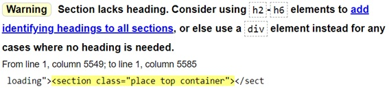
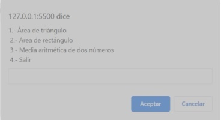

# Nombre: Manuel Gómez Ruiz
# Asignatura: Desarrollo Web en Entorno Cliente
# Fecha: 28/09/2024
# Curso: 2º Desarrollo de Aplicaciones Web

## 1.	¿Por qué es conveniente tener instalados al menos dos navegadores diferentes en tu ordenador? Indica el nombre del motor HTML y JavaScript de 2 navegadores que elijas. (4 ptos)

Debido a que cada navegador tiene integraciones diferentes, pueden visualizar las etiquetas HTML de forma distinta según la versión HTML que soporten. Algunos navegadores incluso pueden no reconocer ciertas etiquetas, impidiendo su visualización (como ocurre en el caso de la etiqueta center en algunas versiones de Opera).

Además, cada navegador aplica estilos personalizados a los elementos básicos, como el tamaño de los saltos de línea, haciendo que el mismo contenido se vea de manera diferente dependiendo del navegador usado.

Estas diferencias pueden hacer que la experiencia visual de un sitio web cambie según el navegador.

Por otro lado, si un navegador deja de funcionar correctamente o presenta una vulnerabilidad, tener otro navegador te permite seguir navegando de forma segura hasta que se solucione el problema.

### Opera

Motor HTML: Blink.
Motor JavaScript: V8.

### Firefox

Motor HTML: Gecko.
Motor JavaScript: SpiderMonkey.

## 2.	¿Por qué se habla de intérprete de JavaScript y no de compilador? Busca las diferencias entre ambas formas de traducir el código (3 ptos)

Por la forma de traducir el código que tiene JavaScript y los lenguajes interpretados en general.

Los lenguajes interpretados ejecutan código línea a línea y en tiempo real, por lo que son más lentos debido a que cada línea debe ser procesada en cada ejecución, como ventaja si hay un error de ejecución, el intérpreta te indica la línea donde ocurrió, facilitando la depuración.

En cambio, los lenguajes compilados traducen el código a un lenguaje intermedio (bytecode), y ejecutan todo el código de una vez, tienen la ventaja que una vez compilado, puede volver a ejecutarse las veces que quieras sin tener que volver a realizar el proceso de compilación, pero si ocurre un error durante la ejecución será difícil determinar donde ocurrió.

## 3.	Usando la dirección de validación de W3C, realiza la validación de la página https://developer.mozilla.org/es/docs/Web/JavaScript. Indica la solución de un error de tipo Info, otro Warning y otro Error (3 ptos)

En este caso la barra inclinada para cerrar la etiqueta meta no es necesaria y puede causar problemas, lo mejor sería eliminarla.

Las secciones deben tener un encabezado que describa su contenido, para mejorar la accesibilidad y la estructura del documento, debes añadir la etiqueta h2.

El valor combobox no es válido para el atributo role en el elemento input, elimínalo.

### Para realizar los scripts, solamente se utilizará lo visto por la unidad. Para la entrada de datos se utilizará el método prompt () y console.log () para mostrar los resultados. Es importante utilizar comentarios para ir aclarando las funcionalidades del script.

## 1. ECMAScript es la especificación de referencia que controla la evolución del lenguaje JavaScript. Investiga sobre la especificación y revisa el historial de cambios más importantes que se han producido en el lenguaje en los últimos años. Indica la última versión y los cambios aportados. (1.5 ptos)

Es una especificación de lenguaje de programación basado en JavaScript, actualmente la mayoría de los navegadores incluyen una implementación de este estándar.

La primera edición de ECMAScript se publicó en 1997.

El año siguiente cambio de editorial y publicó la segunda versión para mantener la especificación alineada con el estándar ISO/IEC 16262. En 1999, con la versión 3, se agregaron características como expresiones regulares, mejor manejo de cadenas (strings) y manejo de excepciones mediante try/catch.

La versión 5 (publicada en 2009) agrega el modo estricto (subconjunto destinado a proporcionar una mejor comprobación de errores), getters y setters, librería para el soporte de JSON y nuevas propiedades para los objetos.

La versión 6 (publicada en 2015) agregó cambios significativos en la sintaxis para facilitar la escritura de aplicaciones complejas, incluyendo clases y módulos, así como iteradores y bucles for/of, generadores, tipos de datos binarios y nuevas colecciones.

La versión 8 (publicada en 2017) introdujo async/await, que revolucionó la forma de manejar el código asíncrono haciendo más fácil escribirlo y leerlo sin anidar promesas (Promise), simplificando la programación asíncrona y mejorando la legibilidad y mantenimiento del código.

La última versión (versión 14 2023) ha traído mejoras para el manejo de tuplas, registros y expresiones regulares, mejoras de rendimiento y nuevos métodos para el manejo de arrays. 

## 2. Números: Crea un script que muestre los números impares que no sean múltiplo de 3 ni de 7 que se encuentren entre el 100 al 1. Realizar versiones del programa usando bucles while, do while y for (2.5 ptos)

### Números impares que no sean múltiplos de 3 ni 7 con bucle While.

[Código HTML](./exercise-2/exercise-with-while/index.html)

[Código JavaScript](./exercise-2/exercise-with-while/src/script.js)

### Números impares que no sean múltiplos de 3 ni 7 con bucle Do While.

[Código HTML](./exercise-2/exercise-do-while/index.html)

[Código JavaScript](./exercise-2/exercise-do-while/src/script.js)

### Números impares que no sean múltiplos de 3 ni 7 con bucle for.

[Código HTML](./exercise-2/exercise-with-for/index.html)

[Código JavaScript](./exercise-2/exercise-with-for/src/script.js)

## 3. Realiza un script con if y otro con switch que permita introducir la edad de una persona, mediante la función prompt y muestre un mensaje dependiendo la edad. (2.5 ptos)

##  - Si la edad es menor de 18 años, se mostrar el mensaje, "Eres menor de edad".

##  - Si la edad es mayor de 18 y menor o igual de 30 de años, se mostrar el mensaje, "Eres muy joven".

##  - Si la edad es mayor de 30 y menor o igual de 60 de años, se mostrar el mensaje, "Eres una persona adulta".

##  - Si la edad es mayor de 60, se mostrar el mensaje, "Eres una persona adulta mayor".

##  - Si la edad es un dato incorrecto, mostrar un mensaje "Error, debe ser un número" 

### Script usando IF.

[Ejercicio 3 Código HTML](./exercise-3/exercise-with-if/index.html)

[Ejercicio 3 Código JS con IF](./exercise-3/exercise-with-if/src/script.js)

### Script usando Switch.

[Ejercicio 3 Código HTML](./exercise-3/exercise-with-switch/index.html)

[Ejercicio 3 Código JS Usando Switch](./exercise-3/exercise-with-switch/src/script.js)

## 4. Escribe un programa que ponga en práctica la siguiente lógica (3.5 ptos):

##  a. Mostrar el siguiente menú y el usuario deberá elegir una de las opciones

##  b. En función de la opción que elija el usuario se le pedirán los datos necesarios en cada caso.

##  c. El programa calculará el resultado y lo mostrará en la consola.

##  d. La lógica anterior se repetirá indefinidamente hasta que el usuario pulse la opción 4 para salir que mostrará un mensaje por consola, Fin del ejercicio.

##  e. Si la opción no está entre el rango 1-4 se mostrará un error mediante la función alert () y se volverá a pedir otra opción.

[Ejercicio 4 Código HTML](./exercise-4/index.html)

[Ejercicio 4 Código JS](./exercise-4/src/script.js)

Notas: 

• Cada ejercicio tendrá un archivo HTML y un fichero externo donde se encontrará el código javascript.

• Los comentario y calidad del código también son un CE que se evaluar.

• Si hay una parte del script que se utilizan métodos/funciones que no se hayan visto en esta unidad, no se evaluará el item

